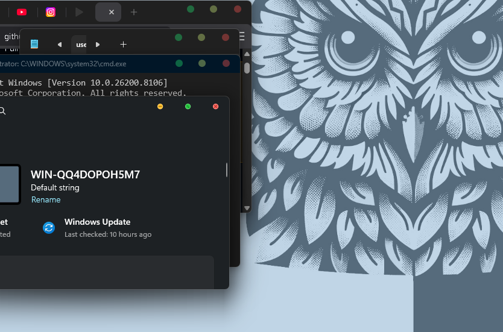

<div align="center">
  <h1>Jhon-Lloyd Molino Tahoe Titlebar</h1>
  <p><strong>One-click Tahoe-style close, minimize, maximize, taskbar, and Start menu glass for Windows.</strong></p>

  

  <br><br>

  <a href="https://github.com/warpusTOM/Tahoe-Style-Min-Max-Close/releases/latest">
    
  </a>
  
  
  
</div>

---

Tahoe Titlebar is a small Windows customizer that applies the macOS Tahoe-style traffic-light buttons to the normal Windows close, minimize, and maximize controls. When StartAllBack is already installed, it also applies the matching translucent taskbar and Start menu profile.

It was built for one-click testing across machines: run it as administrator, choose **Fix Everything Automatically**, wait for the diagnosis/install/verify flow, then read the final Full / Partial / Failed report.

## Download

Get the latest public build from:

[github.com/warpusTOM/Tahoe-Style-Min-Max-Close/releases/latest](https://github.com/warpusTOM/Tahoe-Style-Min-Max-Close/releases/latest)

The public release is intentionally safe to redistribute. It does not include Microsoft system DLLs, and it does not claim a full visual replacement when the theme/assets or Settings/UWP patch are missing or not active.

## One-Click Options

- **Fix Everything Automatically** runs diagnosis, creates the `Assets` folder if needed, applies every safe supported change, verifies the result, and opens a final report.
- **Old Windows close/minimize/maximize + taskbar** restores from the latest backup when available.

Backups are written to:

```text
C:\ProgramData\JhonLloydMolino\TahoeTitlebar\Backups
```

## What It Changes

- Tahoe theme and `.msstyles` package when assets are embedded, supplied in `.\Assets`, or already installed locally as `TahoeTraffic` / compatible local mac-style theme assets. If only the `.theme` file is missing, the app generates it automatically.
- Browser native titlebar settings for Brave, Chrome, and Edge.
- Windows Terminal titlebar settings.
- DWM, dark mode, and titlebar-related registry settings.
- StartAllBack taskbar and Start menu glass profile when StartAllBack is already installed.
- Explorer taskbar visibility/alignment values that support the Tahoe taskbar profile.
- Guarded `ApplicationFrame.dll` replacement support for Settings/UWP titlebars only when the current Windows build/hash is explicitly supported, or when a private sidecar manifest declares an exact original SHA256 and patched SHA256 for a matching patch asset.

## Auto Diagnose and Final Report

Before installing, the app checks:

- Windows version/build and current `ApplicationFrame.dll` SHA256.
- Whether `TahoeTraffic.theme`, `TahoeTraffic.msstyles`, `ApplicationFrame.dll.patched`, and private `ApplicationFrame.patch.json` metadata are available as embedded assets, sidecar assets, or safe local installed assets.
- StartAllBack installation.
- Windows Terminal settings path.
- Brave, Chrome, and Edge executables, profiles, and shortcuts.

After installing, the app opens a final report with:

- `Full` only when the core Tahoe theme/`.msstyles` install succeeded, Windows reports the Tahoe visual style as active, and the Settings/UWP `ApplicationFrame.dll` titlebar patch is already applied or was applied safely.
- `Partial` when safe parts were applied but any titlebar surface was skipped, including unsupported Settings/UWP `ApplicationFrame.dll` hashes, missing patch assets, or missing core theme assets.
- `Failed` when no supported changes were applied.

Unsupported `ApplicationFrame.dll` builds are never patched blindly. They are reported as `Settings/UWP patch skipped`, while safe parts still run. If Windows reports the active theme as `%LOCALAPPDATA%\Microsoft\Windows\Themes\Custom.theme`, the app reads that file and checks its `[VisualStyles] Path` before deciding whether TahoeTraffic is active.

## StartAllBack Profile

This project does **not** bundle StartAllBack, its license, or its private program files. Install StartAllBack separately first, then run the one-click EXE.

The Tahoe profile applies these portable settings:

- Taskbar glass/translucency with alpha `26` and blur `0`.
- Start menu translucency with alpha `36` and blur `0`.
- Tahoe-style taskbar coloring, centered/spaced taskbar icon behavior, and Explorer taskbar cleanup.
- A locally generated neutral Tahoe traffic-light orb at:

```text
%LOCALAPPDATA%\StartAllBack\Orbs\Tahoe Traffic Orb.bmp
```

The installer backs up the previous StartAllBack and Explorer registry settings before changing them.

## Build

Public-safe build:

```powershell
dotnet publish .\TahoeTitlebarOneClick.csproj -c Release -r win-x64 --self-contained true /p:PublishSingleFile=true
```

Private test build with local assets embedded:

```powershell
dotnet publish .\TahoeTitlebarOneClick.csproj -c Release -r win-x64 --self-contained true /p:PublishSingleFile=true /p:EmbedPrivateAssets=true
```

## Private Assets

This source tree does not publish private/test binary assets. For your own private machine build, place redistributable or locally tested assets in `Assets\` before publishing:

- `TahoeTraffic.theme`
- `TahoeTraffic.msstyles`
- `ApplicationFrame.dll.patched`
- `ApplicationFrame.patch.json`

Do not publicly redistribute Microsoft system DLLs as standalone assets.

For public builds, the app can generate `TahoeTraffic.theme` and can reuse an already-installed local `TahoeTraffic.msstyles` or compatible local mac-style theme. Users may also provide their own allowed sidecar files in `.\Assets` beside the EXE:

```text
Assets\TahoeTraffic.theme
Assets\TahoeTraffic.msstyles
Assets\ApplicationFrame.dll.patched
Assets\ApplicationFrame.patch.json
```

The DLL patch is used only if the current `ApplicationFrame.dll` hash matches the supported-build table in source code, or if a private `ApplicationFrame.patch.json` beside the EXE declares the exact current original hash and expected patched hash. The app verifies the patch asset hash before copying and verifies the installed system DLL hash after copying.

### Private force patch manifest

For a private/local build or sidecar-only test on your own machine, put both files beside the EXE:

```text
Assets\ApplicationFrame.dll.patched
Assets\ApplicationFrame.patch.json
```

Example manifest:

```json
{
  "id": "private-26200-8037",
  "windowsBuild": "Windows 10 Pro 25H2, build 26200.8037",
  "originalSha256": "CE3523DCFDBE417937CE98B3FD21C78498D018D756099BB76553AFE05E0948E2",
  "patchedSha256": "SHA256_OF_YOUR_PATCHED_APPLICATIONFRAME_DLL",
  "patchedAssetName": "ApplicationFrame.dll.patched"
}
```

This is the only force path. Without a matching manifest and patched hash, the app still skips the system DLL patch to avoid installing the wrong `ApplicationFrame.dll`.
